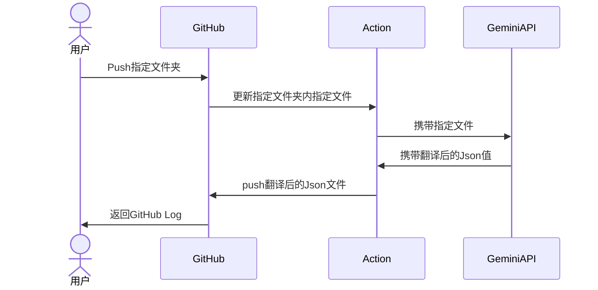
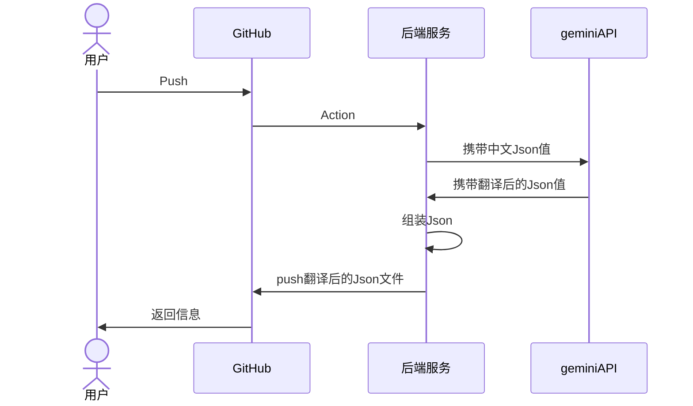

# MVP

GitHub仓库里的中文Markdown文档提交后，自动生成英文和日文文档。

## 用户流程 version 0.1

```mermaid
sequenceDiagram
    actor 用户
    用户->>GitHub:Push指定文件夹
    GitHub->>Action:更新指定文件夹内指定文件
    Action->>GeminiAPI:携带指定文件
    GeminiAPI->>Action:携带翻译后的Json值
    Action->>GitHub:push翻译后的Json文件
    GitHub->>用户:返回GitHub Log
```

## 版本更新

各个版本更新内容

### version 0.1

- 支持文件类型选择
- 支持模型设置·切换

### version 0

```mermaid
sequenceDiagram
    actor 用户
    用户->>GitHub: Push
    GitHub->>后端服务:Action
    后端服务->>geminiAPI:携带中文Json值
    geminiAPI->>后端服务:携带翻译后的Json值
    后端服务->>后端服务:组装Json
    后端服务->>GitHub:push翻译后的Json文件
    GitHub->>用户:返回信息
```
