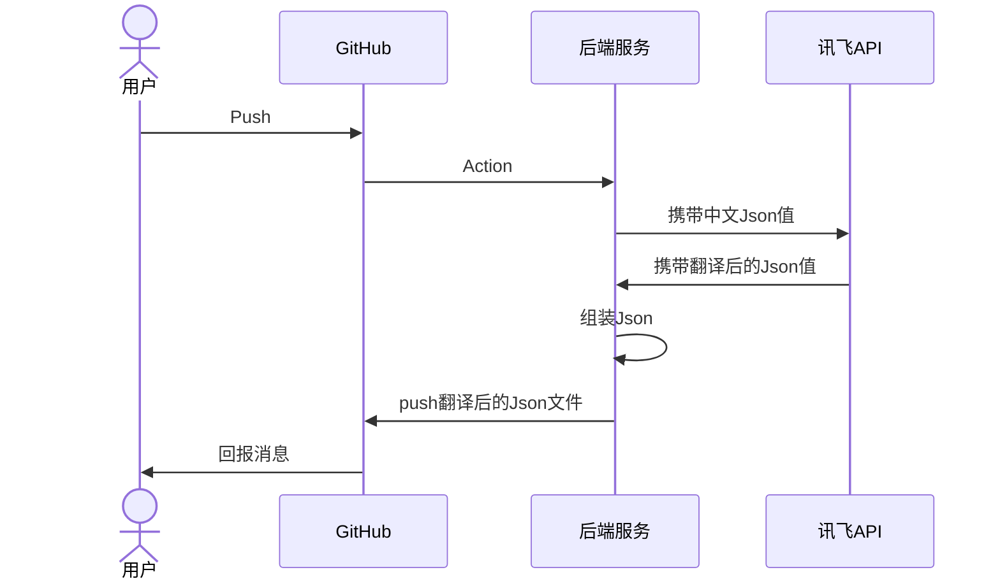

# MVP

GitHub仓库里的中文Markdown文档提交后，自动生成英文和日文文档。

## 用户流程

```mermaid
sequenceDiagram
    actor 用户
    用户->>GitHub: Push
    GitHub->>后端服务:Action
    后端服务->>讯飞API:携带中文Json值
    讯飞API->>后端服务:携带翻译后的Json值
    后端服务->>后端服务:组装Json
    后端服务->>GitHub:push翻译后的Json文件
    GitHub->>用户:回报消息
```
